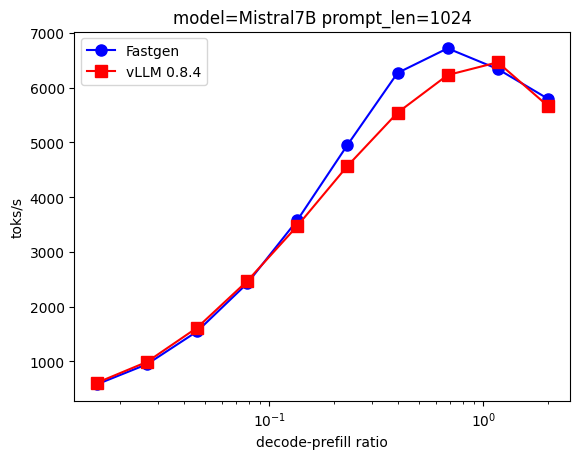

# Fastgen

**High-throughput inference from dense transformers.**

Fastgen is an LLM inference library featuring state-of-the-art
techniques: batched inference, cuda graphs, paged attention,
chunked prefills, host-side kv-cache, tensor parallelism,
cpu/gpu profiling.

You can see it as a mini (~3kloc) vLLM that is easily imported
into larger systems such as RL loops or synthetic data generation
pipelines.

The following HuggingFace models are known to be supported:
Llama 3.1 8B, Mistral 7B, Ministral 8B, R1-Llama 8B and 70B,
R1-Qwen 14B, Qwen2.5 7B and 14B; more may work.

## Benchmarks

|                       | Fastgen      | vLLM (0.8.4) |
| --------------------- | ------------ | -----------  |
| Mistral 7B / 1x H100  | 3430 toks/s  | 3390 toks/s  |
| Qwen2.5 14B / 1x H100 | 1700 toks/s  | 1700 toks/s  |
| Llama 70B / 8x H100   | 2260 toks/s  | 2230 toks/s  |

The throughputs presented in this table were collected using
`fgserve` (see below) and `vllm serve` with a load of 128
decoding steps for 512 prompts of 1024 tokens. The figure
below shows more detailed results for the Mistral 7B model
across a range of generation loads.



> [!NOTE]
> When running tests against `fgserve` you might observe
> reduced performance for short prompts. This lower
> performance is due to the unoptimized threaded HTTP
> serving code and causes Fastgen to run on small
> (inefficient) batches. Production applications using
> Fastgen should adopt process-based parallelism.

## Demo Tools

The library comes with two tools: `fgchat` and `fgserve`.
The first tool is a basic demo implementing a command-line
chat; the second one serves a bare-bones OpenAI chat API.

### fgchat

```
$ # on an RTX A5000
$ # accelerate inference with '--tensor-parallel N' if you have N GPUs
$ fgchat mistralai/Mistral-7B-Instruct-v0.3  
loading: 100%|███████████████████████▉| 14.5G/14.5G [00:00<00:00, 75.9GB/s]
Ready to chat!
  Available commands:
    /r <N> -- reset conversation before round N
    /m     -- input a multiline message, end your input
              with a single line containing '.'
    /q     -- quit

---
1> hello
Hello! How can I help you today? [...]
--- [33 tokens, 26.554toks/s]
2> can you give me some makeup advice?
Of course! Here are some general makeup tips that might be helpful:

[...]
--- [489 tokens, 34.715toks/s]
3> /q
```

### fgserve

```
$ fgserve mistralai/Mistral-7B-Instruct-v0.3  
...
$ cat test.py
from openai import OpenAI
client = OpenAI(base_url="http://localhost:5678", api_key="foo")

completion = client.chat.completions.create(
    model="gpt-4o-mini",
    messages=[
        {"role": "system", "content": "You are a helpful assistant."},
    ] + [
        {
            "role": "user",
            "content": "Write a haiku about recursion in programming."
        }
    ]
)
print(completion.choices[0].message.content)

$ python test.py
Code dives within,
Echoes of self repeat,
Solving the unseen.
```

## Acknowledgements

Thanks to:
- The [vLLM project](https://github.com/vllm-project/vllm) for
  inspiration and for most of the innovations (paged attention,
  chunked prefills, ...) leveraged in Fastgen.
- Daniel Haziza ([@danthe3rd](https://github.com/danthe3rd)) for
  constructive initial design discussions as well as continued
  advice on achieving high GPU utilization.

## License

Fastgen is BSD 3-Clause licensed, as found in the LICENSE file.
